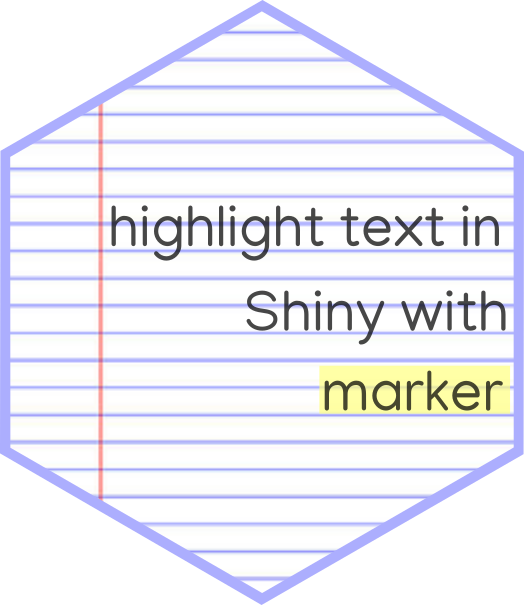
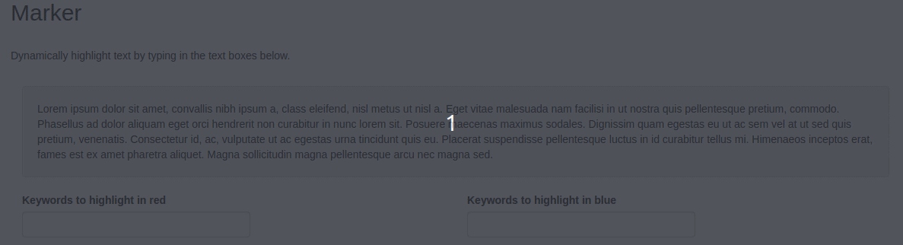

<!-- badges: start -->
[](https://travis-ci.org/JohnCoene/marker)
[](https://ci.appveyor.com/project/JohnCoene/marker)
<!-- badges: end -->

# marker



Highlight text in Shiny with [markjs](https://markjs.io/).

## Installation

You can install the package from Github with:

``` r
# install.packages("remotes")
remotes::install_github("JohnCoene/marker")
```

## Example



Run the app above with `marker_demo()`.

🚨 Remember to always include `use_marker` at the top of your shiny UI.

``` r
library(shiny)
library(marker)

data(lorem, package = "marker")

ui <- fluidPage(
  use_marker(), # include dependencies
  p(id = "text-to-mark", lorem),
  textInput("text", "text to highlight")
)

server <- function(input, output){

  # initialise the marker to point at our text
  marker <- marker$new("#text-to-mark")
  
  observeEvent(input$text, {
    marker$
      unmark()$ # unmark all before we mark
      mark(input$text) # highlight text
  })

}

shinyApp(ui, server)
```

Plenty of options can be found in the [official documentation](https://markjs.io/).

``` r
library(shiny)
library(marker)

data(lorem, package = "marker")

ui <- fluidPage(
  use_marker(),
  h2("Test app"),
  tags$head(
    tags$style(
      ".red{background-color:#FFB8C3;}.blue{background-color:#6ECFEA;}"
    )
  ),
  p(id = "text-to-mark",lorem),
  textInput("text", "text to highlight"),
  textInput("text2", "text to highlight")
)

server <- function(input, output){

  marker <- marker$new("#text-to-mark")
  
  observeEvent(input$text, {
    marker$
      unmark(className = "red")$ # unmark red class
      mark(input$text, className = "red") # add red class
  })

  observeEvent(input$text2, {
    marker$
      unmark(className = "blue")$ # unmark blue class
      mark(input$text2, className = "blue") # add blue class
  })

}

shinyApp(ui, server)
```
